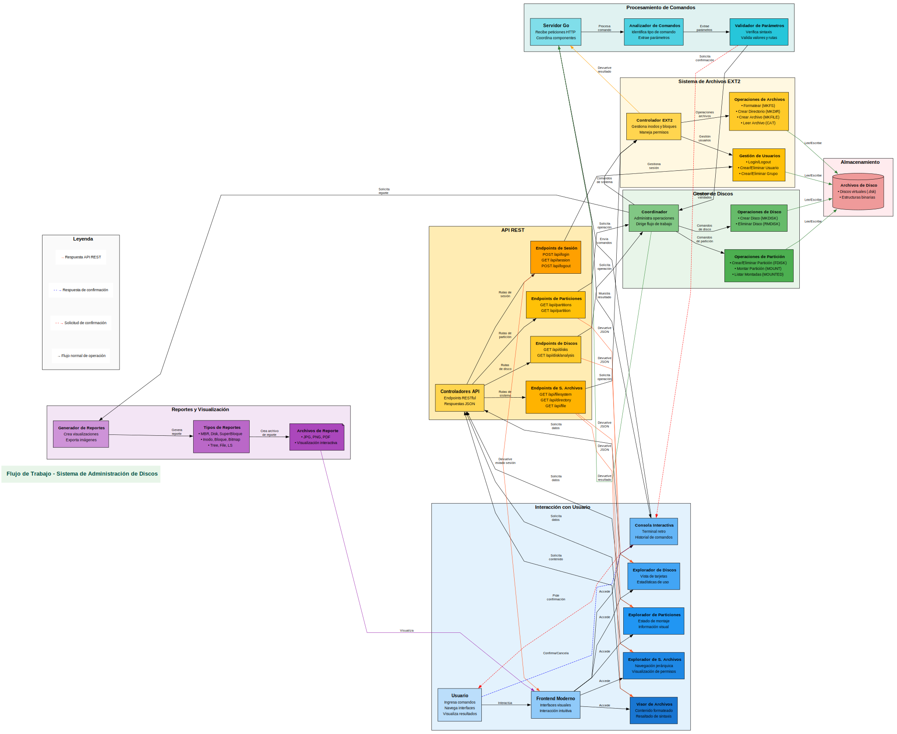
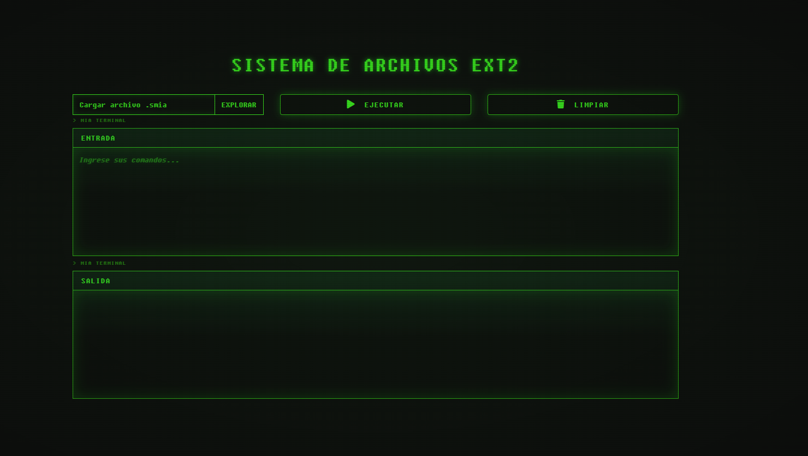
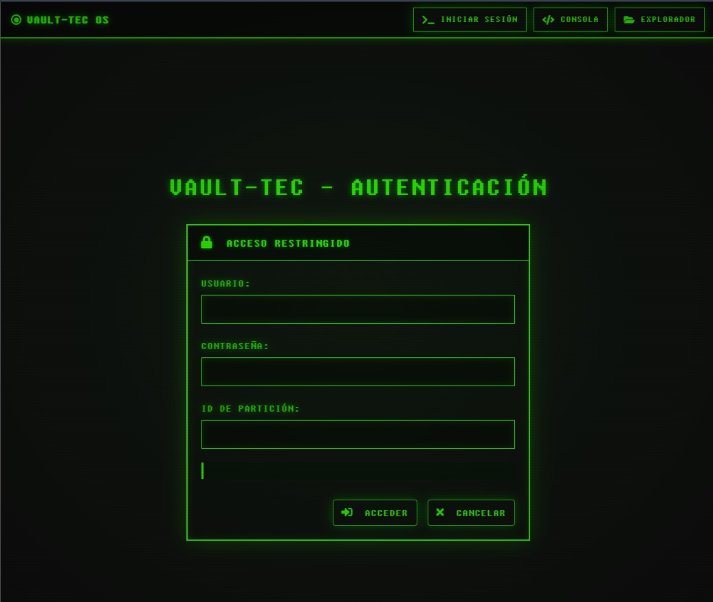
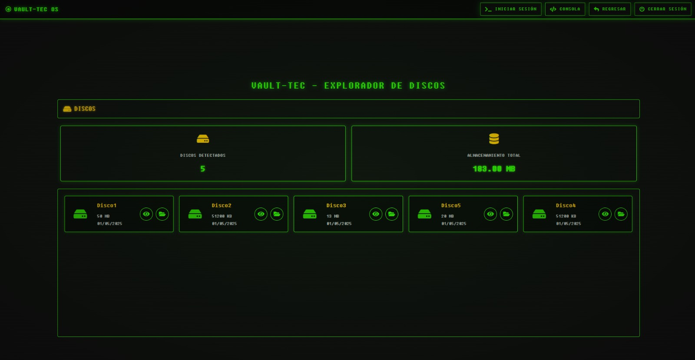
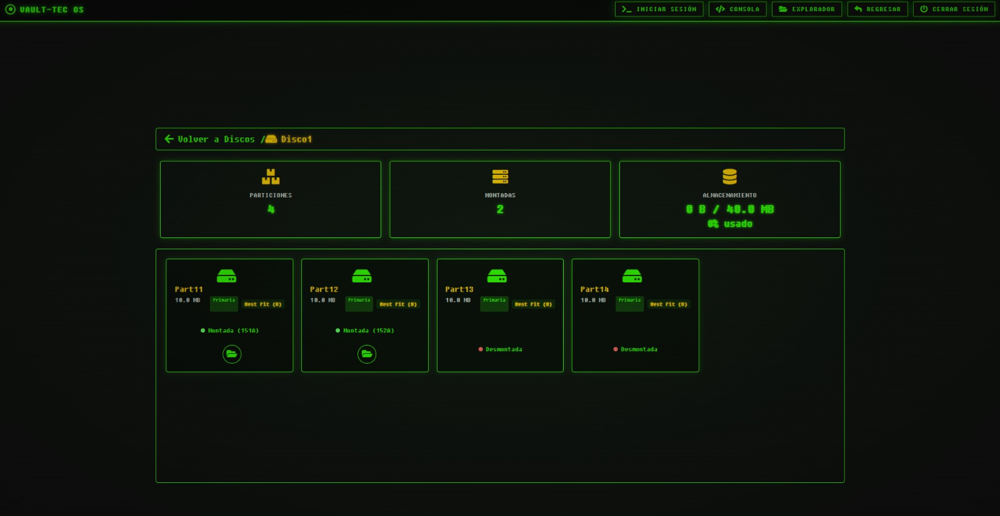
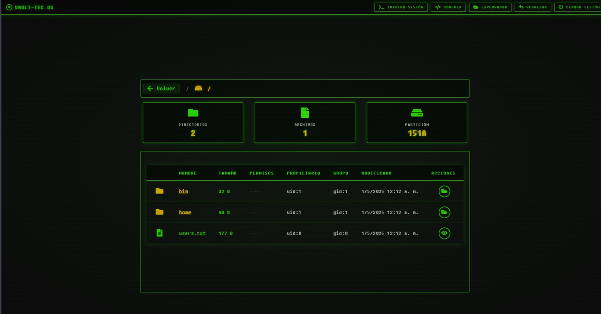
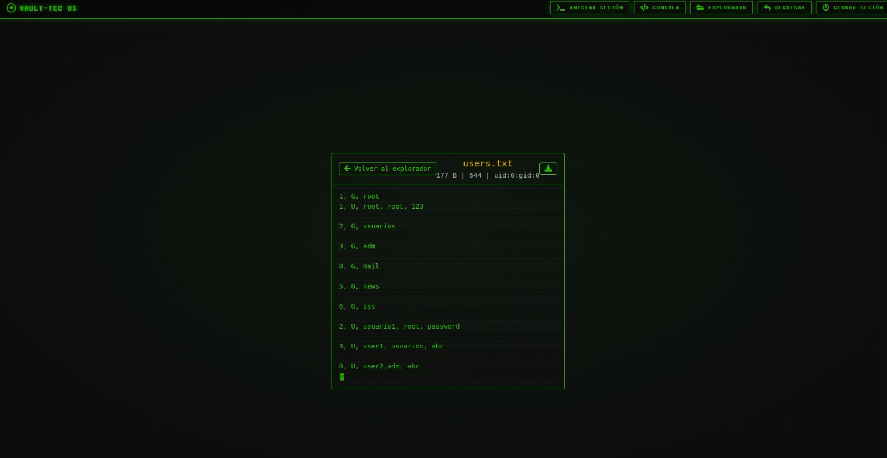

# Documentación Técnica: Sistema de Administración de Discos y Sistema de Archivos EXT2

## Proyecto #2

### Primer Semestre de 2024

```js
Universidad San Carlos de Guatemala
Programador: Angel Guillermo de Jesús Pérez Jiménez 
Carne: 202100215
Correo: 3870961320101@ingenieria.usac.edu.gt
```

## 1. Descripción General del Proyecto

Este proyecto implementa un sistema completo para administrar discos virtuales y un sistema de archivos EXT2. Desarrollado en Go con una interfaz web, permite crear, manipular y visualizar estructuras de discos, particiones y sistema de archivos mediante una serie de comandos especializados. El sistema está diseñado con un enfoque modular, separando claramente las responsabilidades entre analizador de comandos, gestor de discos y sistema de archivos.

## 2. Arquitectura del Sistema

El sistema se compone de tres componentes principales:

- **Frontend:** Interfaz web con una consola interactiva.
- **Analizador de Comandos:** Interpreta y valida comandos del usuario.
- **Gestor de Discos:** Ejecuta operaciones en discos, particiones y sistema de archivos.

La arquitectura sigue un patrón cliente-servidor donde el frontend envía comandos al servidor Go, que los analiza, valida y ejecuta utilizando sus componentes especializados.

## 3. Componentes Principales

### 3.1 Frontend (Interfaz de Usuario)

Construido con HTML, CSS y JavaScript, proporciona una experiencia completa mediante múltiples vistas interactivas:

#### Consola Interactiva

- Terminal estilo retro para entrada directa de comandos.
- Historial de comandos ejecutados con resultados.
- Soporte para scripts con múltiples comandos en ejecución secuencial.
- Auto-desplazamiento para mostrar siempre los resultados más recientes.

#### Exploradores Visuales

- **Explorador de Discos**: Visualización de todos los discos disponibles en formato de tarjetas con tamaño, fecha de creación, y acciones disponibles.
- **Explorador de Particiones**: Interfaz visual para ver y gestionar particiones por disco, con indicadores de estado y tipo.
- **Explorador de Sistema de Archivos**: Navegación jerárquica por directorios con visualización de permisos, propietarios y metadatos.
- **Visor de Archivos**: Interfaz para visualización de contenido de archivos con soporte para diferentes tipos.

#### Características Avanzadas

- Tema visual retro inspirado en terminales clásicas con efectos CRT.
- Sistema de navegación con breadcrumbs para directorios.
- Notificaciones y diálogos de confirmación para operaciones críticas.
- Diseño responsivo adaptable a diferentes dispositivos y tamaños de pantalla.
- Animaciones y transiciones para mejorar la experiencia de usuario.
- Integración completa con las API REST del backend.

### 3.2 Analizador de Comandos

Módulo que procesa la entrada del usuario:

- Identifica tipos de comandos mediante análisis léxico simple.
- Extrae parámetros con sus valores (formato `-parámetro=valor`).
- Valida sintaxis y semántica de cada comando.
- Distribuye comandos a sus manejadores específicos.
- Gestiona respuestas y mensajes de error.
- Maneja confirmaciones para operaciones potencialmente peligrosas.

### 3.3 Gestor de Discos (DiskManager)

Núcleo del sistema que implementa:

- Creación y eliminación de discos virtuales (archivos binarios).
- Particionado conforme a estándar MBR (primarias, extendidas, lógicas).
- Sistema de montaje con identificadores únicos.
- Formateo e inicialización de sistema de archivos EXT2.
- Operaciones CRUD para archivos y directorios.
- Gestión de usuarios, grupos y permisos.
- Generación de reportes visuales de estructuras internas.

## 4. Sistema de Archivos EXT2

### 4.1 Estructuras Implementadas

- **Superbloque:** Almacena metadatos del sistema de archivos.
- **Bitmap de Inodos:** Registra inodos libres/ocupados.
- **Bitmap de Bloques:** Registra bloques libres/ocupados.
- **Tabla de Inodos:** Almacena inodos (metadatos de archivos).
- **Bloques de Datos:** Almacena contenido de archivos/directorios.
- **Bloques de Punteros:** Maneja referencia a bloques para archivos grandes.

### 4.2 Características Implementadas

- Sistema de archivos jerárquico con directorios y archivos.
- Bloque de directorios con entradas `.` y `..`.
- Sistema de permisos `rwx` para propietario, grupo y otros (`755/644`).
- Gestión de bloques directos e indirectos (simple, doble, triple).
- Gestión de espacio eficiente con asignación dinámica.
- Recuperación de espacio al eliminar archivos/directorios.
- Fechas de creación, modificación y acceso.

## 5. Comandos Principales

### 5.1 Gestión de Discos

- `MKDISK`: Crea un disco virtual con tamaño específico.
- `RMDISK`: Elimina un disco virtual existente.
- `FDISK`: Crea, elimina o modifica particiones.
- `MOUNT`: Monta una partición para su uso.
- `MOUNTED`: Lista particiones montadas.

### 5.2 Sistema de Archivos

- `MKFS`: Formatea una partición con sistema EXT2.
- `MKDIR`: Crea directorios en el sistema de archivos.
- `MKFILE`: Crea archivos con contenido opcional.
- `CAT`: Muestra contenido de archivos.

### 5.3 Usuarios y Permisos

- `LOGIN/LOGOUT`: Gestión de sesión de usuario.
- `MKGRP/RMGRP`: Administra grupos de usuarios.
- `MKUSR/RMUSR`: Administra usuarios del sistema.
- `CHGRP`: Cambia grupo principal de usuario.

### 5.4 Reportes

- `REP`: Genera reportes visuales con diferentes tipos:
  - `MBR`: Estructura del Master Boot Record.
  - `DISK`: Visualización del disco y particiones.
  - `SB`: Detalles del Superbloque.
  - `INODE`: Información de inodos.
  - `BLOCK`: Visualización de bloques.
  - `BM_INODE`: Bitmap de inodos.
  - `BM_BLOCK`: Bitmap de bloques.
  - `TREE`: Árbol de directorios y archivos.
  - `LS`: Listado de directorios.
  - `FILE`: Contenido y detalles de archivo.

## 6. Flujo de Ejecución Típico

1. Usuario introduce comando en la interfaz web.
2. Frontend envía comando al servidor Go.
3. Analizador identifica tipo de comando y extrae parámetros.
4. Validador específico verifica integridad y coherencia.
5. Manejador ejecuta operación usando componentes del DiskManager.
6. Sistema genera respuesta y la envía al frontend.
7. Frontend muestra resultados y/o visualizaciones.

## 7. Gestión de Errores

- Validación exhaustiva de parámetros antes de ejecutar comandos.
- Verificación de existencia de archivos, directorios y particiones.
- Control de permisos basado en usuario actual.
- Manejo de conflictos en operaciones (nombres duplicados, etc.).
- Confirmaciones para operaciones destructivas o riesgosas.
- Sistema de logging para depuración y auditoría.

## 8. Tecnologías Utilizadas

- **Go:** Lenguaje principal del backend.
- **Gin:** Framework HTTP para Go.
- **JavaScript/HTML/CSS:** Frontend y consola interactiva.
- **Graphviz:** Generación de visualizaciones y reportes.
- **Manejo binario puro:** Para manipulación de estructuras en disco.

## 9. Seguridad

- Control de acceso basado en usuario/grupo.
- Permisos `rwx` para propietario, grupo y otros.
- Prevención de eliminación accidental con confirmaciones.
- Validación de rutas para prevenir acceso no autorizado.

## 10. Limitaciones y Consideraciones

- Implementación educativa del estándar EXT2.
- Optimizado para operaciones interactivas más que para alto rendimiento.
- No implementa journal (como en EXT3/EXT4).

## 11. Diagrama del proyecto



## 12. API REST del Sistema

El sistema proporciona una interfaz API REST completa que permite la interacción programática con todas las funcionalidades del gestor de discos y sistema de archivos.

### 12.1 Endpoints para Gestión de Discos

| Endpoint | Método | Descripción | Parámetros |
|----------|--------|-------------|------------|
| `/api/disks` | GET | Obtiene listado de todos los discos disponibles | Ninguno |
| `/api/disks/analysis` | GET | Obtiene análisis completo de todos los discos | Ninguno |
| `/api/disk/analysis` | GET | Obtiene análisis detallado de un disco específico | `path` (ruta del disco) |

**Ejemplo de respuesta `/api/disks`:**

```json
{
  "discos": [
    {
      "path": "/home/user/discos/Disco1.dsk",
      "name": "Disco1.dsk",
      "size": 1024,
      "unit": "M",
      "createdAt": "2025-05-01T10:30:45Z",
      "fit": "F"
    }
  ],
  "total": 1
}
```

### 12.2 Endpoints para Gestión de Particiones

| Endpoint                | Método | Descripción                              | Parámetros                        |
|-------------------------|--------|------------------------------------------|-----------------------------------|
| `/api/partitions`        | GET    | Obtiene información de todas las particiones | Ninguno                           |
| `/api/disk/partitions`   | GET    | Obtiene particiones de un disco específico   | `path` (ruta del disco)           |
| `/api/partition`         | GET    | Obtiene información detallada de una partición | `id` (identificador de montaje)   |

**Ejemplo de respuesta `/api/disk/partitions:`**

```json
{
  "particiones": [
    {
      "name": "Part1",
      "status": "active",
      "type": "P",
      "fit": "F",
      "start": 16384,
      "size": 262144,
      "mountId": "65VD1"
    }
  ],
  "total": 1
}
```

### 12.3 Endpoints para Sistema de Archivos

| Endpoint               | Método | Descripción                                      | Parámetros                                          |
|------------------------|--------|--------------------------------------------------|-----------------------------------------------------|
| `/api/filesystem`      | GET    | Obtiene estructura completa del sistema de archivos | `id` (identificador de montaje)                     |
| `/api/file`            | GET    | Obtiene contenido y metadatos de un archivo específico | `id` (identificador de montaje), `path` (ruta del archivo) |
| `/api/directory`       | GET    | Lista el contenido de un directorio específico   | `id` (identificador de montaje), `path` (ruta del directorio) |

**Ejemplo de respuesta ``/api/directory:``**

```json
{
  "directorio": "/home",
  "nombre": "home",
  "contenido": [
    {
      "name": "users.txt",
      "type": "file",
      "path": "/home/users.txt",
      "size": 177,
      "permissions": "rwxr-xr-x",
      "owner": "root",
      "group": "root",
      "modifiedAt": "2025-05-01T12:12:00Z"
    },
    {
      "name": "configs",
      "type": "directory",
      "path": "/home/configs",
      "size": 48,
      "permissions": "rwxr-xr-x",
      "owner": "root",
      "group": "root",
      "modifiedAt": "2025-05-01T12:12:00Z"
    }
  ],
  "total": 2,
  "exito": true
}
```

### 12.4 Endpoints para Gestión de Sesiones

| Endpoint          | Método | Descripción                      | Parámetros                                      |
|-------------------|--------|----------------------------------|-------------------------------------------------|
| `/api/login`      | POST   | Inicia sesión de usuario         | `username`, `password`, `id` (identificador de montaje) |
| `/api/session`    | GET    | Obtiene información de la sesión actual | Ninguno (usa cookies de sesión)               |
| `/api/logout`     | POST   | Cierra la sesión actual          | Ninguno (usa cookies de sesión)               |

**Ejemplo de solicitud `/api/login:`**

```json
{
  "username": "root",
  "password": "123",
  "id": "65VD1"
}
```

## 13. Anexos

Esta sección incluye capturas de pantalla de las principales interfaces del sistema, mostrando el diseño retro y la funcionalidad implementada.

### 13.1 Consola Interactiva

La consola interactiva proporciona una experiencia similar a una terminal retro, permitiendo a los usuarios ejecutar comandos directamente. Incluye características como historial de comandos, y soporte para scripts con múltiples instrucciones.



*Figura 13.1: Consola interactiva con estilo retro mostrando como se visualiza.*

### 13.2 Interfaz de Inicio de Sesión

La interfaz de inicio de sesión permite a los usuarios autenticarse en el sistema de archivos EXT2 utilizando sus credenciales. Mantiene el estilo visual retro característico del sistema y proporciona campos para seleccionar la partición montada, nombre de usuario y contraseña.



*Figura 13.2: Pantalla de inicio de sesión con campos para autenticación y selección de partición montada.*

### 13.3 Explorador de Discos

El explorador de discos muestra todos los discos virtuales disponibles en un formato de tarjetas, proporcionando información visual rápida sobre cada uno. Cada tarjeta incluye detalles como el tamaño del disco, fecha de creación, tipo de ajuste y acciones disponibles.



*Figura 13.3: Interfaz del explorador de discos mostrando discos disponibles con sus características y opciones.*

### 13.4 Explorador de Particiones

El explorador de particiones permite visualizar y gestionar las particiones de un disco seleccionado. La interfaz muestra claramente el tipo de partición (primaria, extendida o lógica), su estado de montaje y otras características importantes.



*Figura 13.4: Vista del explorador de particiones con indicadores visuales de tipo y estado de montaje.*

### 13.5 Explorador del Sistema de Archivos

Esta interfaz permite la navegación jerárquica a través del sistema de archivos EXT2. Muestra directorios y archivos con información detallada sobre permisos, propietarios, grupos y fechas de modificación, facilitando la administración del sistema de archivos.



*Figura 13.5: Explorador del sistema de archivos con visualización de la estructura jerárquica y metadatos.*

### 13.6 Visor de Archivos

El visor de archivos proporciona una interfaz especializada para visualizar el contenido de diferentes tipos de archivos. Incluye características como resaltado de sintaxis para archivos de texto, representación adecuada según el tipo de archivo y opciones para operaciones básicas.



*Figura 13.6: Visor de archivos mostrando el contenido de un archivo de texto con información de metadatos.*
