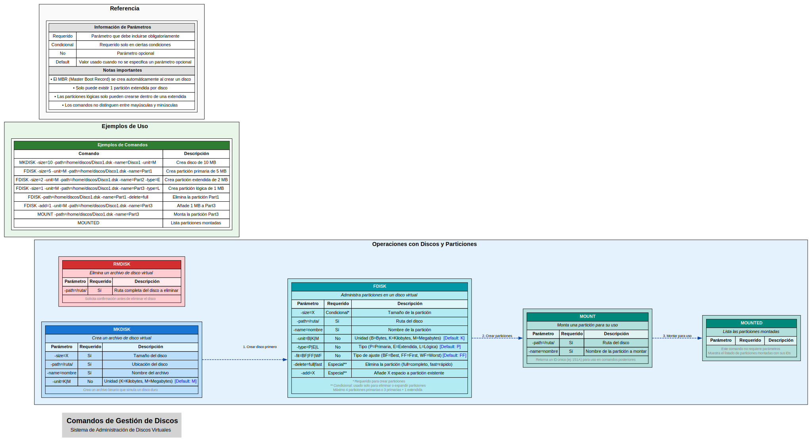
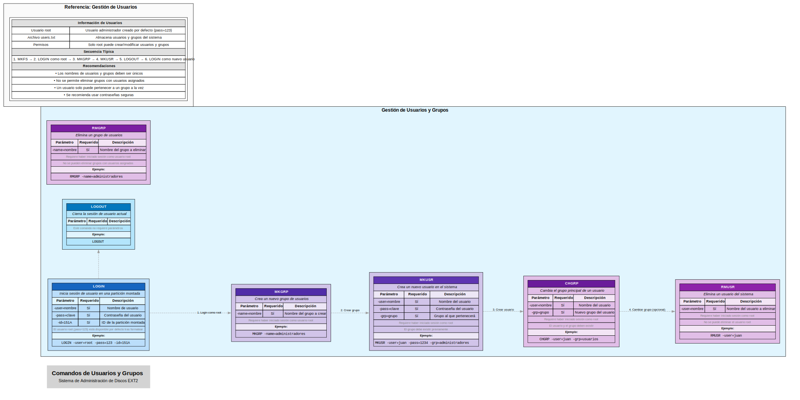
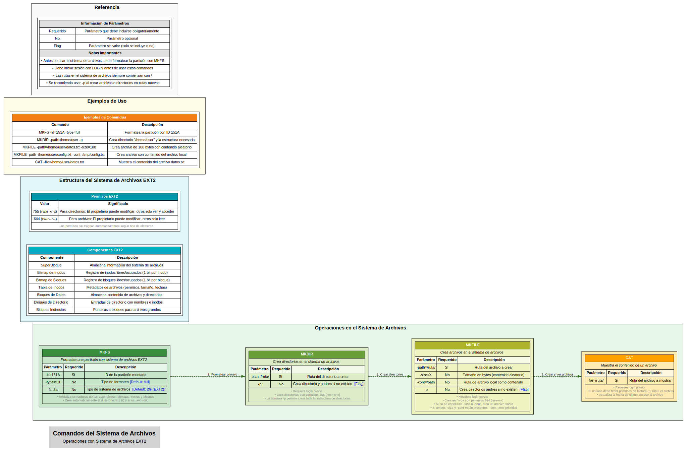

# Documentación de Comandos: Sistema de Administración de Discos y Sistema de Archivos EXT2

## Proyecto #1

### Primer Semestre de 2024

```js
Universidad San Carlos de Guatemala
Programador: Angel Guillermo de Jesús Pérez Jiménez 
Carne: 202100215
Correo: 3870961320101@ingenieria.usac.edu.gt
```

## 1. Descripción General del Proyecto

Este proyecto implementa un sistema completo para administrar discos virtuales y un sistema de archivos EXT2. Desarrollado en Go con una interfaz web, permite crear, manipular y visualizar estructuras de discos, particiones y sistema de archivos mediante una serie de comandos especializados. El sistema está diseñado con un enfoque modular, separando claramente las responsabilidades entre analizador de comandos, gestor de discos y sistema de archivos.

## 2. Comandos para creacion de discos



## 3. Comandos para creacion de Usuarios



## 4. Comandos para creacion de Archivos



## 5. Comandos para creacion de Reportes


## 6. Vista general de todos los comandos


